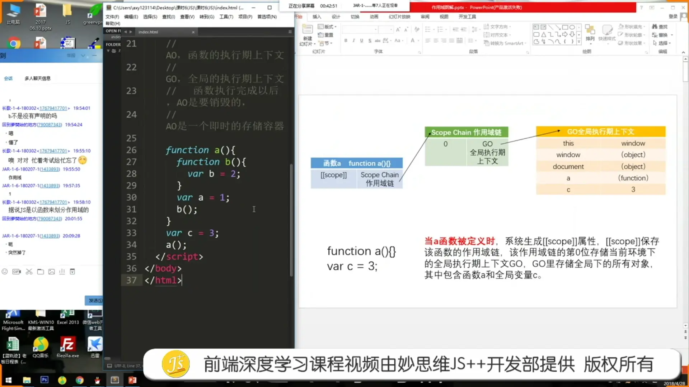
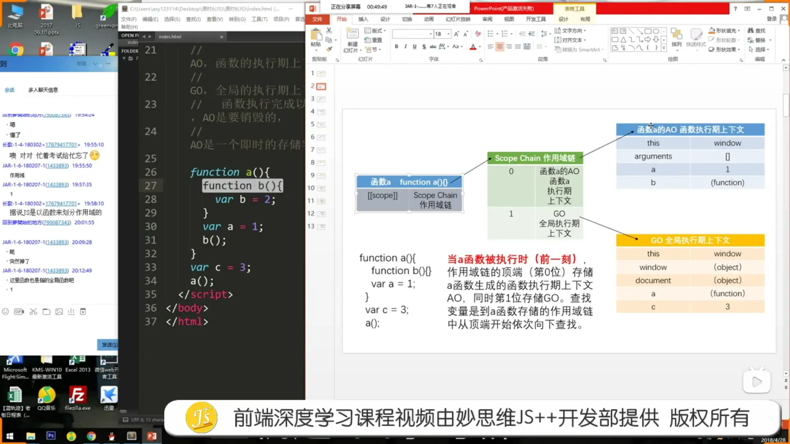
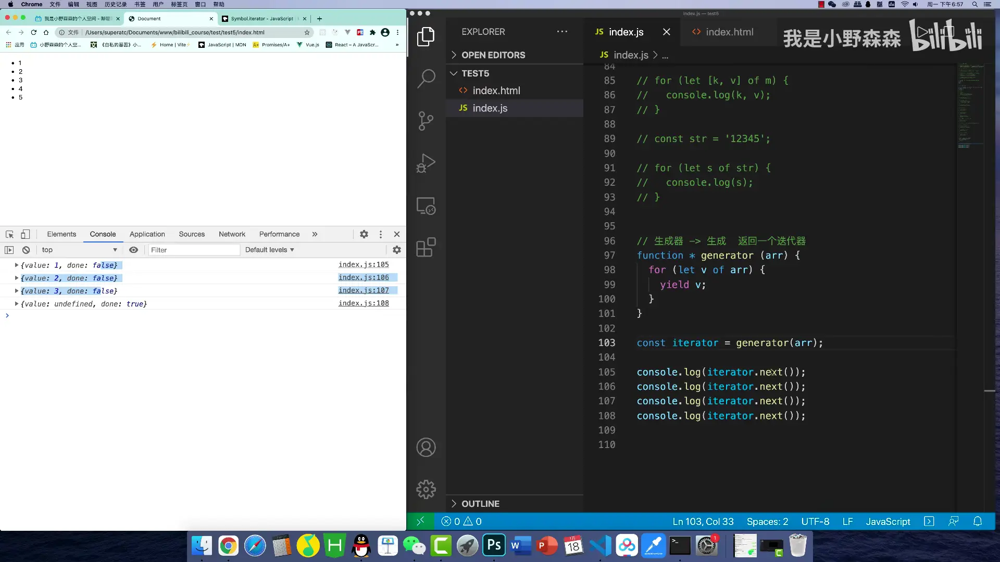
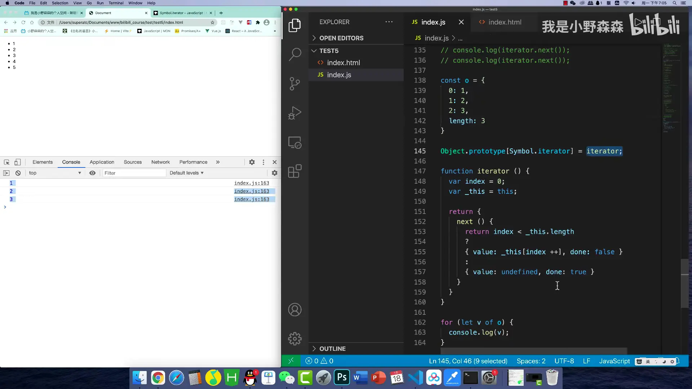

## 预编译

1. 通篇检查语法错误
2. 解释一行,执行一行

## AO(activation object,活跃对象,函数执行期上下文)

1. 寻找形参和变量声明
2. 实参赋值给形参
3. 寻找函数声明,赋值
4. 执行

## GO(global object,全局执行期上下文)

1. 寻找变量
2. 寻找函数声明
3. 执行

### 一些题目

```javascript
if(typeof(a) && (-true) + (-undefined) + ''){
  console.log('pass')
} else {
  console.log('unpass')
}
// pass

console.log(!!' ' + !!'' + !!false || 'pass')
// 1
```

## 作用域链





函数在被定义还没执行时就已经有了全局作用域

`[[scope]]`函数执行完即被销毁,使用外部正常情况下无法访问函数内部数据

当内部函数被返回到外部并保存时,一定会产生闭包,闭包会产生原来的作用域链不释放

## 原型

`prototype` 函数的一个属性

`__proto__` Object的一个属性 类似于链条,连着上一层

object的`__proto__`保存着构造函数的`prototype`

```javascript
Function.__proto__ === Function.prototype // true 底层规定
Object.__proto__ === Function.prototype // true
```

## new

过程

1. 生成一个空对象 this -> {}
2. `this.__proto__` -> 构造函数.prototype
3. 返回this

## 生成器

```javascript
// 生成器的存在为了返回一个迭代器
```





## 你不知道的Object

### assign

合并`自身`可`枚举`属性

同一引用

```javascript
const merged = Object.assign(target, ...sources);

merged === target // true
```

### create

参数

1. 原型指向
2. OwnProperties

```javascript
Object.create(null) // 无原型

Object.create({}, {
  prop: {
    value,
    configurable: false, // 增加删除
    writable: false, // 修改
    enumerable: false, // 枚举
    get: function() {},
    set: function(valve) {},
  }, //descriptor
})
```

### entries/fromEntries

+ 原型不参与
+ 自身可枚举
+ 只作用在第一层

```javascript
{a: 1, b: 2} <=> [['a', 1], ['b', 2]]
```

### freeze

+ 对象(数组)冻结 自身属性
+ 同一引用
+ 浅冻结

```javascript
{
  value,
  configurable: false, // 增加删除
  writable: false, // 修改
  enumerable: true, // 枚举
}
  
obj.__proto__ = {} // X 严格模式报错
```

### seal

1. 对象(数组)封闭 自身属性
2. 同一引用
3. 浅封闭

```javascript
{
  value,
  configurable: false, // 增加删除
  writable: true, // 修改
  enumerable: true, // 枚举
  get, // X
  set, // X
}
  
obj.__proto__ = {} // X
```

### preventExtensions

1. 禁止扩展

```javascript
{
  value,
  configurable: false, // 增加不可删除可
  writable: true, // 修改
  enumerable: true, // 枚举
  get, // X
  set, // X
}
  
obj.__proto__ = {} // X
```

### 总结(非空对象情况下)

| \            | freeze | seal | preventExtensions |
| ------------ | ------ | ---- | ----------------- |
| isFrozen     | y      | n    | n                 |
| isSealed     | y      | y    | n                 |
| isExtensible | y      | y    | y                 |

##数据树形结构化

> 一个扁平数据列表 => 描述树形结构的字段 PID => 树形结构列表
>
> PID => ID

1. 顶级与子级数据分开
2. 递归或其他操作

```typescript
const data = [
  {
    id: 2,
    pid: 0,
    path: '/course',
    name: 'Course',
    title: '课程管理',
  },
  {
    id: 3,
    pid: 2,
    path: 'operate',
    link: '/course/operate',
    name: 'CourseOperate',
    title: '课程操作',
  },
  {
    id: 4,
    pid: 3,
    path: 'info_data',
    link: '/course/operate/info_data',
    name: 'CourseInfoData',
    title: '课程数据',
  },
  {
    id: 5,
    pid: 2,
    path: 'add',
    link: '/course/add',
    name: 'CourseAdd',
    title: '课程增加',
  },
  {
    id: 6,
    pid: 0,
    path: '/student',
    name: 'Student',
    title: '学生管理',
  },
  {
    id: 7,
    pid: 6,
    path: 'operate',
    link: '/course/operate',
    name: 'StudentOperate',
    title: '学生操作',
  },
  {
    id: 8,
    pid: 6,
    path: 'add',
    link: '/student/add',
    name: 'Course',
    title: '学生增加',
  },
]

console.log(formatDataTree(data))

// 扁平化处理
// 第二种写法,有人说只做了第一层,为什么最后还是形成了树,是因为filter拿的是后面数组元素的引用,后面再给子元素添加它的子元素,已经添加到第一层的子元素也会跟着改
function formatDataTree(data: any[]) {
  let _data: any[] = JSON.parse(JSON.stringify(data))

  return _data.filter((p) => {
    const _arr = _data.filter((c) => c.pid === p.id)
    _arr.length && (p.children = _arr)
    return p.pid === 0
  })
}

// 递归写法
function formatDataTree(data: any[]): any[] {
  let [parents, childrens] = [data.filter(p => p.pid === 0), data.filter(p => p.pid !== 0)]

  dataToTree(parents, childrens)

  function dataToTree(parents: any[], childrens: any[]) {
    parents.forEach((p, i) => {
      childrens.forEach((c) => {
        let _childrens: any[] = JSON.parse(JSON.stringify(childrens))
        _childrens.splice(i, 1)
        dataToTree([c], _childrens)

        if (c.pid === p.id) {
          if (!p.children) {
            p.children = []
          }
          p.children.push(c)
        }
      })
    })
  }

  return parents
}
```

## Array.from

取决于`length`若无默认为零,多裁少补`undefined`

## 继承

### 原型链

```javascript
// 继承父类的原型链和父类实例的属性和方法
function SuperType() {
  this.property = true
}
SuperType.prototype.getSuperValue = function () {
  return this.property
};

function SubType() {
  this.subproperty = false
}
SubType.prototype = new SuperType() // 继承 SuperType
SubType.prototype.getSubValue = function () {
  return this.subproperty
}

let instance = new SubType()
instance.getSuperValue() // true
```

### 盗用构造函数

```javascript
function SuperType() {
	this.colors = ['red', 'blue', 'green']
}

function SubType() {
	SuperType.call(this) // 继承 SuperType
}

let instance1 = new SubType()
instance1.colors.push('black')
instance1.colors // 'red,blue,green,black'

let instance2 = new SubType()
instance2.colors // 'red,blue,green'
```

### 组合继承

```javascript
function SuperType(name) {
  this.name = name
  this.colors = ['red', 'blue', 'green']
}
SuperType.prototype.sayName = function () {
  console.log(this.name)
}

function SubType(name, age) {
  SuperType.call(this, name) // 继承属性
  this.age = age
}
SubType.prototype = new SuperType() // 继承方法
SubType.prototype.sayAge = function () {
  console.log(this.age)
}

let instance1 = new SubType('Nicholas', 29)
instance1.colors.push('black')
console.log(instance1.colors) // 'red,blue,green,black'
instance1.sayName() // 'Nicholas'
instance1.sayAge() // 29

let instance2 = new SubType('Greg', 27)
console.log(instance2.colors) // 'red,blue,green'
instance2.sayName() // 'Greg'
instance2.sayAge() // 27
```

### 原型式

```javascript
// 等同与原型链继承与Object.Create()等效
function object(o) {
  function F() { }
  F.prototype = o
  return new F()
}

let person = {
  name: 'Nicholas',
  friends: ['Shelby', 'Court', 'Van']
}

let anotherPerson = object(person)
anotherPerson.name = 'Greg'
anotherPerson.friends.push('Rob')

let yetAnotherPerson = object(person)
yetAnotherPerson.name = 'Linda'
yetAnotherPerson.friends.push('Barbie')
console.log(person.friends) // 'Shelby,Court,Van,Rob,Barbie'
```

### 寄生式

```javascript
function createAnother(original) {
  let clone = object(original) // 通过调用函数创建一个新对象
  clone.sayHi = function () { // 以某种方式增强这个对象
    console.log('hi')
  }
  return clone // 返回这个对象
}

let person = {
  name: 'Nicholas',
  friends: ['Shelby', 'Court', 'Van']
}

let anotherPerson = createAnother(person)
anotherPerson.sayHi() // 'hi'
```

### 寄生组合式

```javascript
// 即所谓的圣杯模式
function inheritPrototype(subType, superType) {
	let prototype = object(superType.prototype)
	prototype.constructor = subType
	subType.prototype = prototype
}
```

### 圣杯模式

```javascript
// 只继承父类原型链且不继承原型实例的属性和方法
function inherit(Target, Origin) {
  function Buffer() { }
  Buffer.prototype = Origin.prototype
  Target.prototype = new Buffer()
  Target.prototype.constructor = Target // 构造器指向自身
  Target.prototype.super_class = Origin // 继承源
}
```

## 打乱数组

```javascript
function shuffleArray(arr) {

  const newArr = [...arr]

  for (let i = newArr.length - 1; i > 0; i--) {
    const rand = Math.floor(Math.random() * (i + 1));
    [newArr[i], newArr[rand]] = [newArr[rand], newArr[i]]
  }

  return newArr
}
```