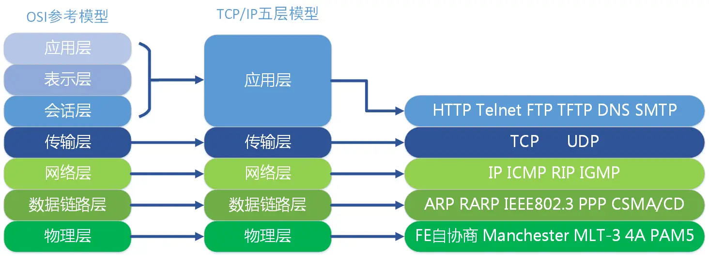

## TCP/IP

### 网络模型

### MAC地址

每台允许入网机器的网卡唯一编号

### IP地址

v4: 四组八位二进制数

v6: 八组四位十六位进制数

动态IP: DHCP服务器

子网掩码: 网络部分全部为一,主机部分全部为零

### 三次握手 四次挥手

[帮助理解的视频](https://www.bilibili.com/video/BV1kV411j7hA)

为保证双方通信的可靠性和时效性

#### 握手

> `客户端`====SYN====> `服务端` 服务端知道客户端有发送能力

> `服务端`==SYN+ACK==> `客户端` 客户端知道服务端有发送和接收能力

> `客户端`====ACK====> `服务端` 服务端知道客户端有接收能力

#### 挥手

> `客户端`==FIN==>`服务端` 确认资源接收完毕,准备断开

> `服务端`==ACK==>`客户端` 确认资源发送完毕,准备断开

> `服务端`==FIN==>`客户端` 确认断开

> `客户端`==ACK==>`服务端` 确认断开

### DNS

> 域名 => IP地址 映射表

## HTTP

### 请求报文

1. 起始行
   1. HTTP方法(GET/POST…)
   2. URL(资源路径)
   3. 协议版本(HTTP/1.1?HTTP/2)
2. 请求头
   1. Host: 主机IP地址或域名
   2. User-Agent: 客户端相关信息
   3. Content-Type: 请求体内容格式
   4. Referer: 防盗链
   5. …
3. 空一行
4. 请求体(如果有)

### 响应报文

1. 状态行
   1. 协议版本
   2. 状态码
   3. 状态文本

2. 响应头
3. 空一行
4. 响应体(响应资源)

### Cookie/Session/Token

http为无状态协议

httpOnly document.cookie无法获取

jsonwebtoken 存储在客户端

Session 存储在服务端的会话

### 版本

1. HTTP/1.1
   1. 明文传输
2. HTTP/2
   1. 二进制传输
   2. 一个TCP连接多路复用
   3. Server Push
   
3. HTTPS
   1. 非对称公钥加密
   2. TLS协议