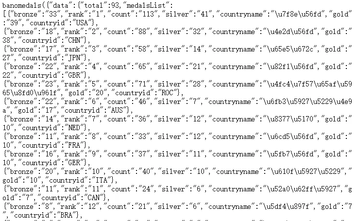
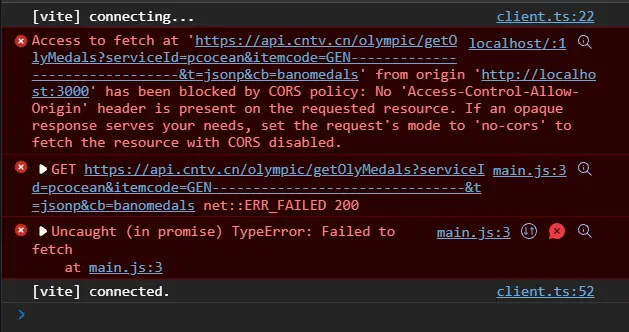
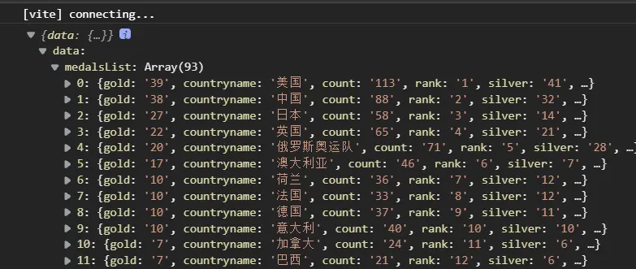
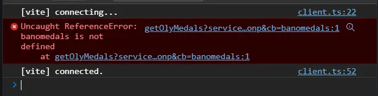

## 介绍

`JSONP`全称`JSON with Padding`,是一种跨域方式,它的原理是利用script标签src属性不会有跨域问题的特性,与服务器约定一个回调函数的名字,服务器将数据作为回调函数的参数返回,从而成功进行跨域请求,客户端使用该函数就能在参数中得到返回的数据


JSONP只支持`GET`方法


## 准备

+ API  
  + 这里我们使用央视2020东京奥运会的接口[2020东京奥运会_体育_央视网(cctv.com)](https://2020.cctv.com/)
  + 这个接口是东京奥运会期间我做奖牌榜项目发现的

## 操作

https://api.cntv.cn/olympic/getOlyMedals?serviceId=pcocean&itemcode=GEN-------------------------------&t=jsonp&cb=banomedals

1. 现在我们分析一下这个url,其中有一个查询参数cb,我猜应该是callback的缩写,用来与服务器约定回调函数的名称
2. 我们直接浏览器打开链接看看结果



3. 分析数据结构我们发现返回的是一个名叫`banomedals`的函数,它的参数是一个JSON对象,这证实了我上面的猜测,cb查询参数用来与服务器约定回调函数的名称
4. 接下来我们搭建一个服务器环境,我所使用的是`vite`,使用`fetch`进行Ajax请求

```javascript
const url = 'https://api.cntv.cn/olympic/getOlyMedals?serviceId=pcocean&itemcode=GEN-------------------------------&t=jsonp&cb=banomedals';

fetch(url).then(res => {
  console.log(res.text());
})
```

查看控制台,根据报错显示,果然出现了跨域问题



5. 不慌,一切都在意料之中,接下来我们使用JSONP进行跨域

```javascript
const url = 'https://api.cntv.cn/olympic/getOlyMedals?serviceId=pcocean&itemcode=GEN-------------------------------&t=jsonp&cb=banomedals';

const script = document.createElement('script');
script.src = url;
document.body.prepend(script);

function banomedals(data){
  console.log(data);
}
```



查看控制台,拿到了数据,现在回顾一下JSONP是如何成功跨域的

1. 首先创建了一个script标签
2. 将url赋给script的src的属性
3. 将标签添加在body内的最前面,因为js是逐行解析的我们得保证在先得到数据再进行操作,避免保存
4. 定义一个与url查询参数cb相同名字的函数,它的参数就是我们要请求的数据
5. 这样就成功跨距拿到了数据

## 实践

https://vanilla-probe.vercel.app/example/JSONP/

## 插曲

其实在使用JSONP跨域时发生了一个错误



它提示我们获取数据的回调函数未定义,可是我明明已经定义了,难道是因为是使用箭头函数方式定义的?改成function定义函数,也报错

实际上是因为我的`js`文件加了`type='module'`属性,这样使js文件变成来一个封闭的模块,别的js文件要使用module js里的方法或数据必须得导入导出,把type='module'删除即可